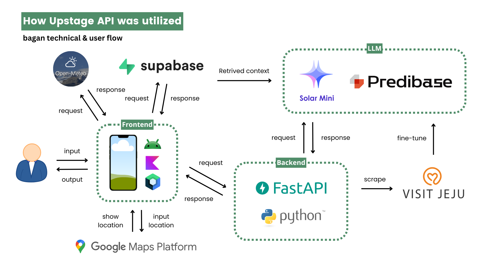

<div align="center">
  
  <h1>JejuWay</h1>
</div>

Discover Jeju the way it’s meant to be experienced—effortlessly, personally, and full of
unforgettable moments. JejuWay is your ultimate travel companion, turning your trip to Jeju Island
into a seamless adventure.

## 🌟 Description

JejuWay is an AI-powered travel app that simplifies your journey to Jeju Island by creating
personalized itineraries tailored to your interests and needs. With real-time recommendations,
weather forecasts, and interactive maps, JejuWay ensures that your trip is not only enjoyable but
also stress-free. Say goodbye to the hassles of planning and enjoy Jeju to the fullest with JejuWay.

## ✨ Features

- **Itinerary Builder**: Effortlessly create a tailored plan for your Jeju trip with JejuWay’s
  powerful itinerary builder. Just input your preferences, and the app does the rest.

- **Personalized Itinerary**: Enjoy a personalized experience with itineraries crafted to match your
  interests—be it nature, food, or culture—so you never miss out on what you love.

- **Interactive Maps & Smooth Itinerary Management**: Navigate your journey with ease using
  JejuWay’s interactive map, while seamlessly managing your schedule in real time. Adjust plans on
  the go and stay organized effortlessly.

- **Smart Weather Forecast**: Stay prepared with accurate, AI-driven weather-based recommendations,
  from activity suggestions to outfit advice, ensuring a perfect day, rain or shine.

## 📸 Screenshots

<table>
  <tbody>
    <tr>
      <td align="center" width="20%">
        Itinerary Builder
      </td>
      <td align="center" width="20%">
        Personalized Itinerary
      </td>
      <td align="center" width="20%">
        Smooth Itinerary Management
      </td>
      <td align="center" width="20%">
        Smart Weather Forecast
      </td>
    </tr>
    <tr>
      <td align="center">
        
      </td>
      <td align="center">
        
      </td>
      <td align="center">
        
      </td>
      <td align="center">
        
      </td>
    </tr>
  </tbody>
</table>

## 🏗️ Architecture Plan

<div align="center">
  
</div>

## 🚀 Installation

To install JejuWay

1. Clone or download the project and open it in Android Studio.
2. Create a `local.properties` file in the project root folder if it doesn't exist.
3. Add the required properties to the `local.properties` file as shown below.

```properties
MAPS_API_KEY="your key here"
UPSTAGE_AI_API_KEY="your key here"
SUPABASE_URL="your supabase url here"
SUPABASE_KEY="your supabase key here"
